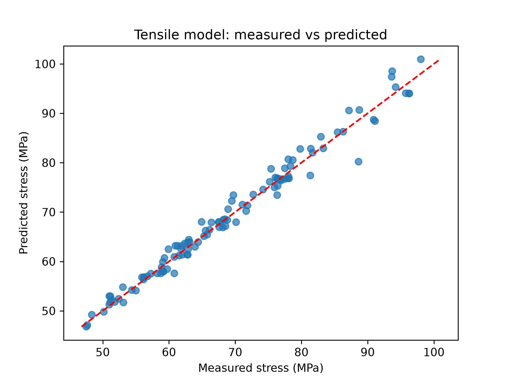
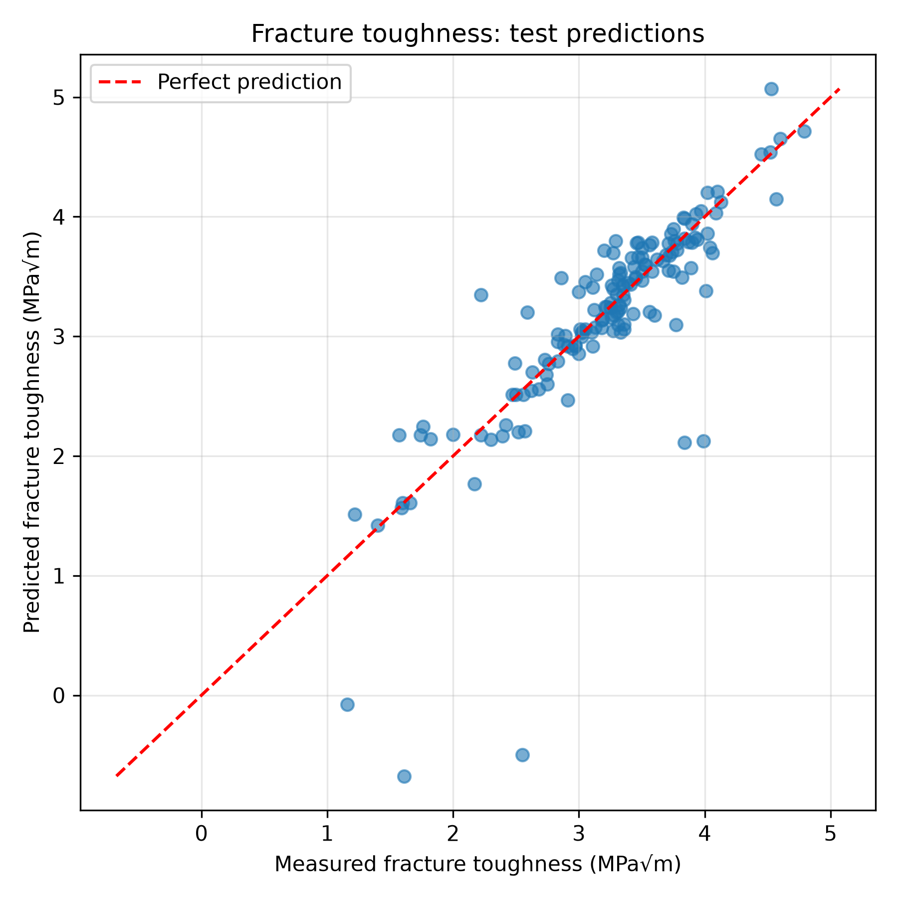

# Predicting Polymer Properties Using Neural Networks

This project explores the use of artificial neural networks to predict two mechanical properties of polymers: tensile strength and Mode I fracture toughness.

The aim is to demonstrate a complete machine-learning workflow applied to an engineering problem—from preparing material data to training models and evaluating their predictions. The project uses a small neural network and a straightforward implementation that is easy to follow.

## Introduction

An artificial neural network learns relationships between inputs and outputs from examples. During training, it adjusts internal weights and biases to reduce the difference between its predictions and known values.

A typical network contains an input layer, one or more hidden layers, and an output layer. Hidden layers use activation functions to learn nonlinear relationships that a simple linear model may not capture.

In mechanical and materials engineering, neural networks can support applications such as:

- Predicting material properties from composition, processing, and testing conditions.
- Estimating component performance from experimental or simulation data.
- Detecting faults using sensor measurements.
- Building approximate models that reduce the need for repeated, expensive simulations.

Their usefulness depends on the quality and coverage of the training data. A model that performs well on familiar materials may still struggle with unfamiliar materials or conditions.

## Project Objectives

- Develop separate neural-network models for tensile strength and fracture toughness.
- Prepare numerical and categorical material data for model training.
- Evaluate predictions using mean absolute error (MAE), R², and measured-versus-predicted plots.
- Understand both the capabilities and limitations of a simple neural network in this application.

## Data and Prediction Targets

The project uses two prepared datasets containing polymer properties and experimental information.

| Model | Dataset size | Prediction target | Unit |
|---|---:|---|---|
| Tensile strength | 549 observations | Recorded applied stress used as the tensile-strength target | MPa |
| Fracture toughness | 762 observations | Recorded Mode I fracture toughness, K_Ic | MPa√m |

The input variables include numerical material properties, testing conditions, and categorical information such as polymer material and moulding method. The exact feature sets differ between the two datasets.

Record identifiers, material-grade labels, and manufacturer/brand names were excluded from the model inputs. Material–grade groups were retained separately to organize the train–test split. Elastic modulus was included in the tensile model.

## Methodology

### 1. Train–Test Split

Each dataset was divided into:

- **80% training data**
- **20% test data**

The split was stratified by material–grade group, keeping approximately the same group proportions in both sets. A fixed random seed of `42` was used for reproducibility.

This means that material grades are shared between the training and test sets. The evaluation therefore concerns additional observations from grades represented during training, rather than completely unfamiliar grades.

### 2. Missing-Value Handling

Missing numerical values were replaced with the median of the corresponding training column.

The same training medians were then applied to the test set. This avoids using test-set information to calculate the replacement values.

### 3. Categorical Encoding

Categorical inputs were converted into numerical indicator columns using one-hot encoding.

The test columns were aligned with the training columns so that both sets had the same input structure and column order.

### 4. Feature Scaling

Numerical features were standardized using `StandardScaler`. The scaler learned the means and standard deviations from the training data and applied the same transformation to both sets.

This helps prevent features with larger numerical ranges from dominating the training process. One-hot encoded indicator columns were left unchanged.

### 5. Neural-Network Training

Separate models were created using scikit-learn’s `MLPRegressor`.

| Setting | Value |
|---|---|
| Hidden layers | 1 |
| Neurons in the hidden layer | 10 |
| Hidden-layer activation | tanh |
| Solver | L-BFGS |
| Final maximum iteration setting | 10,000 |
| Random seed | 42 |

The network was deliberately kept small to demonstrate the workflow without an extensive search across architectures.

The tensile script retains an initial fit with a 2,000-iteration limit followed by a second fit with a 10,000-iteration limit. The second fit starts again under the default settings, and the reported predictions come from that final fit.

The iteration limit is an upper bound and does not guarantee that optimization has converged.

### 6. Evaluation

Both models were assessed using:

- **MAE:** The average absolute difference between measured and predicted values, expressed in the target’s physical units. Lower is better.
- **R²:** Performance relative to predicting the evaluated set’s mean. A value of 1 indicates perfect predictions; 0 matches that baseline; negative values indicate worse performance.
- **Prediction plots:** Measured values plotted against predictions, with a diagonal line showing perfect agreement.
- **Error inspection:** The ten largest test errors were examined alongside their material–grade groups.

## Results

| Model | Training MAE | Test MAE | Training R² | Test R² |
|---|---:|---:|---:|---:|
| Tensile strength | 1.003 MPa | 1.295 MPa | 0.9847 | 0.9799 |
| Fracture toughness | 0.120 MPa√m | 0.232 MPa√m | 0.9209 | 0.5731 |

### Tensile Strength

The tensile model achieved a test R² of approximately **0.980**, with a test MAE of **1.295 MPa**.

The small difference between training and test performance indicates consistent predictions across this particular split. These results support the model’s ability to predict additional observations from represented material grades.

They do not establish equivalent accuracy for new grades or conditions outside the dataset.

### Fracture Toughness

The fracture model achieved a test R² of approximately **0.573**, with a test MAE of **0.232 MPa√m**.

Most predictions followed the measured values reasonably closely, but several large errors reduced overall performance. The larger training–test gap suggests overfitting or difficulty generalizing to some held-out observations.

Three test predictions were negative, all belonging to **PP | J-900GP**. Negative fracture toughness is physically invalid, but the model’s unconstrained regression output permits it.

Two observations from **PC | S3000** were also substantially underestimated. These examples show why individual prediction errors need to be considered alongside average metrics.

## What the Split Changed

Earlier experiments held entire material–grade groups out of training. Those experiments produced substantially poorer test performance:

| Model | Earlier test MAE: held-out grades | Earlier test R² |
|---|---:|---:|
| Tensile strength | 5.599 MPa | 0.395 |
| Fracture toughness | 2.989 MPa√m | −20.833 |

The final split was chosen to match the project’s demonstration objective: predicting observations from materials represented in the training data.

The earlier and final results evaluate different test populations and prediction tasks. The higher final scores should therefore not be interpreted as improved performance on unfamiliar grades.

## Limitations

- Results come from a single train–test split and do not quantify variation across multiple splits.
- Shared material grades make the test task less demanding than predicting unseen grades.
- Related or duplicate experimental observations across the split could make performance appear more optimistic; stratification alone does not prevent this.
- The fracture model can produce physically invalid negative predictions.
- A fixed random seed improves reproducibility, but numerical results can vary across software environments.
- The models are demonstrations, not validated replacements for material testing or engineering design calculations.

## Tools Used

- Python
- pandas
- scikit-learn
- Matplotlib
- Jupyter Notebook
- openpyxl for reading Excel files

The repository includes Python scripts, notebooks, and prediction plots. The Excel datasets are excluded, so reproducing the training runs requires the corresponding source workbooks.

## Conclusion

This project demonstrates how a small neural network can be applied to polymer-property prediction using a clear preprocessing, training, and evaluation workflow.

The tensile model performed strongly on the chosen split, while the fracture model showed more uneven performance and several significant errors. The comparison highlights an important engineering lesson: a useful model must be assessed through its evaluation setup, error patterns, and physical plausibility—not just a high score.